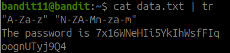
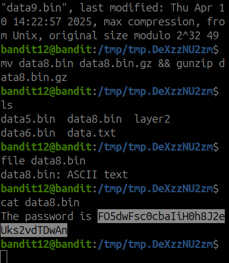

### ✅ Bandit Level 11 - Screenshot

Notes: 
Needed to learn a tad bit of regexing, tr the command allows strings of text to be shifted a certain number depending on the input

This specific solution shifted the data by 13 

### ✅ Bandit Level 12 - Screenshot

Notes: 
This was a pain in the ass, maybe make it automated? multiple ziped and compressed files,

using .bz2 .gz and tar compressed, and xxd -r to reverse hex dump, multiple unzips, and file exgtrations, used
tar xf to extract tar files.

