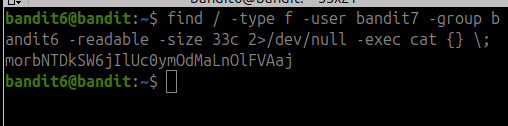
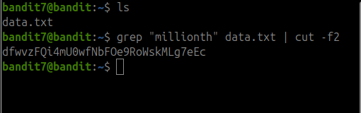
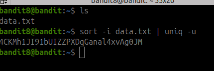
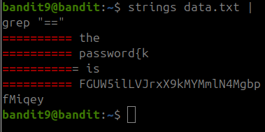
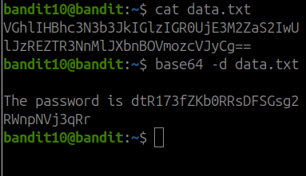

### ✅ Bandit Level 6 - Screenshot

Notes: Had to find specific file on server with a specific user permission

due to spam of permission denied new skill learned 

2> is the standard error, which got redirected into /dev/null removing errors, and sorting out files we had no permission reading.

### ✅ Bandit Level 7- Screenshot

### ✅ Bandit Level 8- Screenshot

Notes: 
had to sort data, so I can use uniq to find the line that only appeared once, using tag -u

### ✅ Bandit Level 9- Screenshot

Notes:
Learned new skill strings, as it onlyprints out human readable text, and in a file filled with garbaged data, cleanign it became much more doable, rather than sorting it through by hand.

 

### ✅ Bandit Level 10 - Screenshot

Notes: 
had a double pad of '==' at the end, so even if not given the information that it was base64 encode, one could infer that it was base64 based on how the string was structured, and padded with.

